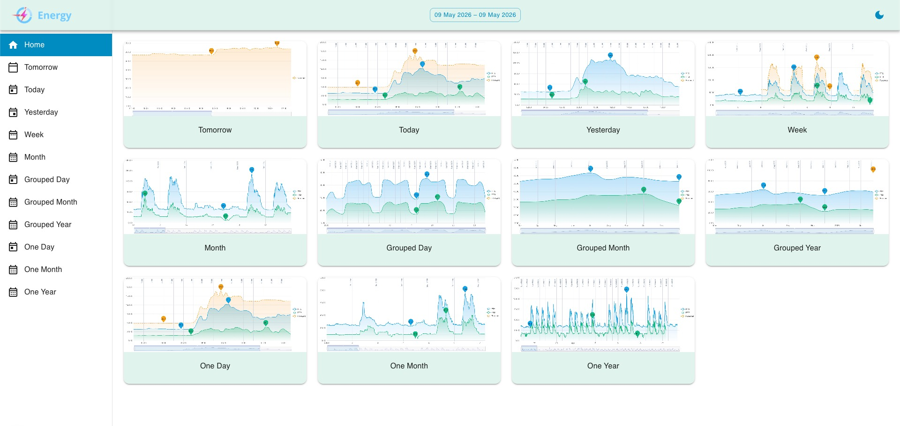
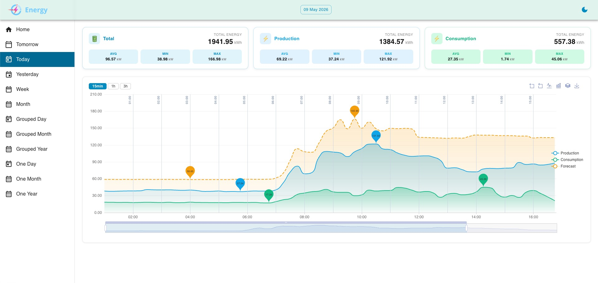
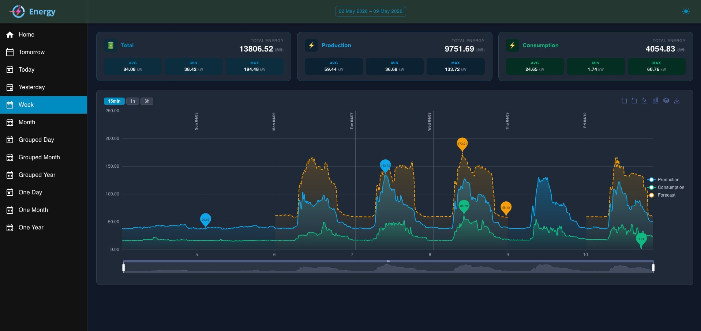
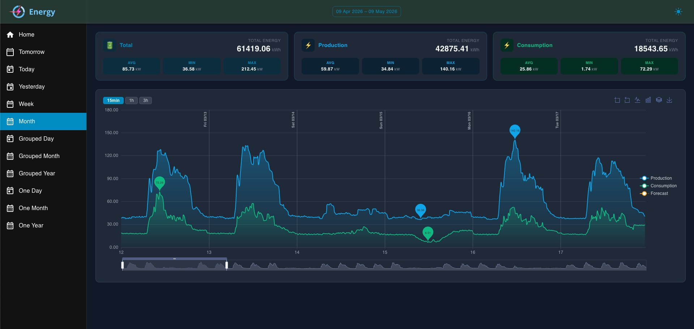
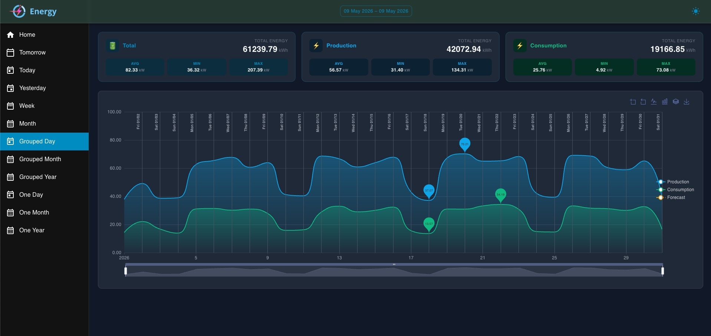
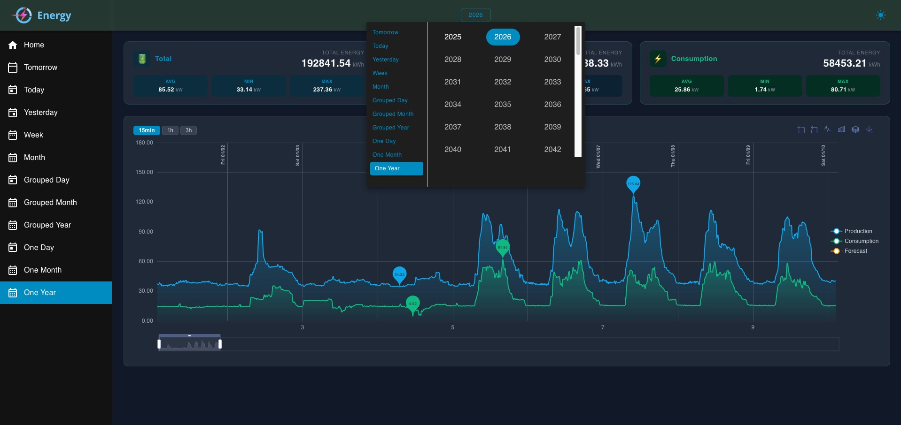

## Energy Dashboard

Create your own dashboards to get fast insight on key figures and metrics.

Dashboards are used to make monitoring of your consumption even more easy and to ensure that you stay informed of what is happening in your home or building in terms of energy. 

## Web Interface

http://localhost:3000

## Demo

https://devrazec.github.io/energy
